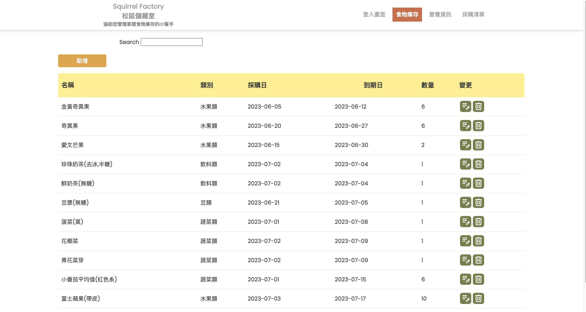
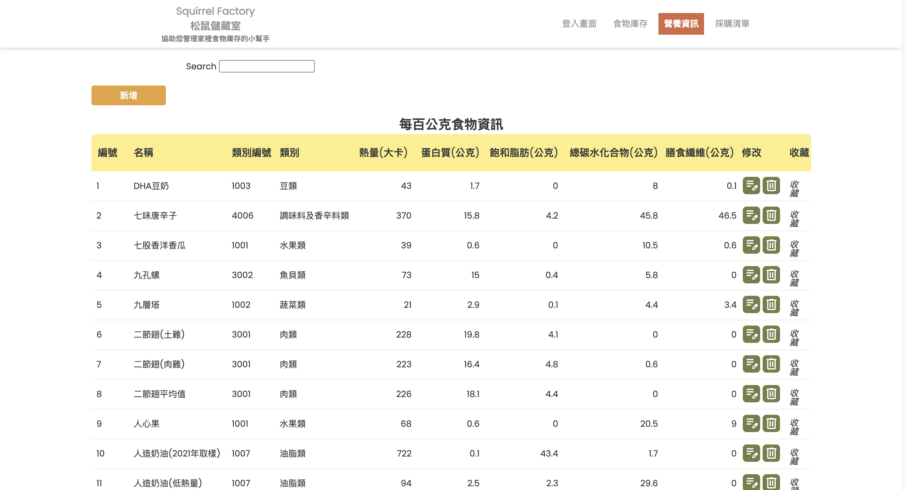
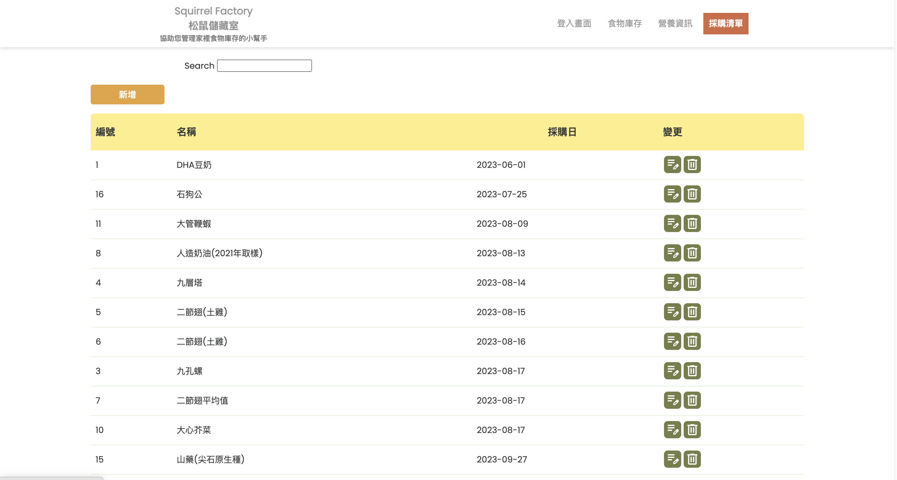
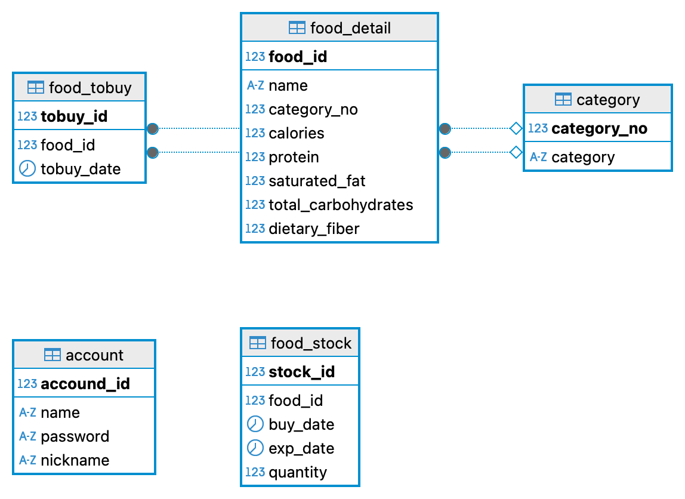

# 食材庫存管理系統

>**本專案為應徵2025國泰資訊人才培訓計畫補件之作品整理專案。**

>專案原始開發時間為2023年，為職前訓練班與組員二人共同開發。  
內容與程式碼由本人負責後端開發，另一位組員負責前端開發，並特別感謝導師的協助與指導。  
**此次我進行了後端的代碼重構，提升了安全性和可維護性。**


## 專案簡介
這是一個基於SpringBoot開發的食材庫存管理系統，幫助使用者有效管理食材庫存與追蹤到期日期，其可檢視食物的營養資訊功能，並支援採購清單的建立與管理。

## 主要功能
-  **食材庫存管理** - 新增、編輯、刪除、查詢食材庫存
-  **營養資訊管理** - 管理食材的營養成分資料
-  **採購清單管理** - 管理待採購的食材清單
-  **搜尋功能** - 快速搜尋食材資訊
-  **完整API** - 提供完整的後端API接口

## 畫面展示
### 食物庫存頁面

### 營養資訊頁面

### 採購清單頁面
排序邏輯是以採購日期為主，讓使用者能優先處理急需採購的項目。



## 技術棧

| 分類     | 技術                    |
| -------- | ----------------------- |
| 後端框架 | Spring Boot 3.1.1       |
| 程式語言 | Java 17                 |
| 資料庫   | MySQL 8.0               |
| 資料存取 | JDBC                    |
| 建構工具 | Maven                   |
| 容器化   | Docker & Docker Compose |
| 前端技術 |  HTML, CSS, JavaScript   |
| 其他     | Lombok                  |


## 快速開始

### 環境需求
- Java 17
- Maven 3.6+
- MySQL 8.0
- Docker

### 安裝步驟

1. **複製專案**
```bash
git clone https://github.com/yenkemiel/food-inventory-management.git
cd food-inventory-management
```
2. **啟動資料庫 (使用Docker)**
```bash
docker-compose up -d
```
3. **匯入資料庫結構**
```bash
mysql -u root -p0000 < foods.sql
```
4. **啟動應用程式**
```bash
mvn spring-boot:run
```
5. **測試API**
打開瀏覽器訪問：http://localhost:8080/foods?page=1&count=10&expDateSortMode=0

### 測試登入
- 帳號：`andy`
- 密碼：`1234`

## 專案架構
```
src
├── main
│   ├── java
│   │   └── com.uch.finalproject
│   │       ├── FinalprojectApplication.java    # 主程式入口
│   │       ├── controller/                     # 控制器層，處理HTTP請求
│   │       ├── model/
│   │       │   ├── entity/                     # 實體類別
│   │       │   └── dto/                        # 資料傳輸物件
│   │       └── util/                           # 工具類別
│   └── resources
│       └── application.properties              # 應用程式配置
├── foods.sql                                   # 資料庫初始化檔案
├── docker-compose.yml                          # Docker配置
└── pom.xml                                     # Maven配置
```
### 架構說明

* **Controller層** - 負責接收HTTP請求，呼叫業務邏輯，回傳回應
* **Entity** - 資料庫實體對應類別，定義資料結構
* **DTO** - 資料傳輸物件，統一API回應格式
* **Util** - 工具類別，提供共用功能（如資料庫連接管理）

### 資料庫設計


## API 文檔

### 食材庫存管理
| 方法 | 端點 | 描述 | 參數 |
|-----|------|------|------|
| GET | `/foods` | 取得食材列表 | page, count, expDateSortMode |
| POST | `/addfood` | 新增食材 | name, category, buyDate, expDate, quantity |
| PUT | `/food` | 更新食材 | stockId, buyDate, expDate, quantity |
| DELETE | `/delfood` | 刪除食材 | stockId |
| GET | `/food` | 搜尋食材 | name, page, count, expDateSortMode |

### 營養資訊管理
| 方法 | 端點 | 描述 | 參數 |
|-----|------|------|------|
| GET | `/foodDetails` | 取得營養資訊列表 | page, count, foodIdSortMode |
| POST | `/addfoodDetail` | 新增營養資訊 | name, category, calories, protein等 |
| PUT | `/updatefoodDetail` | 更新營養資訊 | foodId, name, category, calories等 |
| DELETE | `/delfoodDetail` | 刪除營養資訊 | foodId |

### 採購清單管理
| 方法 | 端點 | 描述 | 參數 |
|-----|------|------|------|
| GET | `/tobuy` | 取得採購清單 | page, count, tobuyDateSortMode |
| PUT | `/updatetobuy` | 更新採購項目 | tobuyId, tobuyDate |
| DELETE | `/deltobuy` | 刪除採購項目 | tobuyId |


### API 回應格式
```json
{
  "code": 0,
  "message": "成功",
  "data": {
    "foods": [...],
    "total": 100
  }
}
```

## 專案重構與優化

本專案在開發過程中進行了多項重構和優化，提升了程式碼的可維護性、安全性和可讀性。

### 架構重構

**重構後結構**

```diff
- src/main/java/com/uch/finalproject/
-   ├── controller/
-   ├── model/             # 混合Entity/DTO
-   └── 雜散檔案
+ src/main/java/com/uch/finalproject/
+   ├── controller/        # HTTP請求處理
+   ├── model/
+   │   ├── entity/        # 資料實體分離
+   │   └── dto/           # 回應物件分離
+   └── util/              # 工具類別統一管理

```

**重構改善：**
* **分離關注點** - Entity和DTO分開管理，職責更清楚
* **新增工具層** - 建立util包，統一管理共用功能
* **檔案整理** - 將散落的檔案歸類到適當位置
* **提升維護性** - 清晰的目錄結構更易於導覽

### 程式碼優化

#### 1. 資料庫連接重構
* **改善前：** 在每個Controller重複寫資料庫連接代碼
* **改善後：** 統一使用DatabaseUtil工具類
```diff
- Class.forName("com.mysql.cj.jdbc.Driver");
- conn = DriverManager.getConnection("jdbc:mysql://localhost/foods?user=root&password=0000");
+ @Autowired
+ private DatabaseUtil databaseUtil;
+ conn = databaseUtil.getConnection();
```

#### 2. 資源管理優化
* **改善前：** 手動關閉資源，容易遺漏
* **改善後：** 統一在finally區塊處理，確保資源正確釋放
```diff
+ } finally {
+     databaseUtil.closeResources(rs, stmt, conn);
+ }
```
#### 3. 輸入驗證強化

* **改善前：** 沒有輸入驗證，直接處理資料
* **改善後：** 加入輸入驗證機制
```diff
+ if (data == null) {
+     return new FoodPageResponse(400, "請求資料不能為空", null, 0);
+ }
+ if (data.getName() == null || data.getName().trim().isEmpty()) {
+     return new FoodPageResponse(400, "食物名稱不能為空", null, 0);
+ }
```

#### 4. 新增完整的文檔
提供詳細的README和API使用說明，便於其他開發者快速上手。


## 開發者
**Kemiel Yen** - [@yenkemiel](https://github.com/yenkemiel)